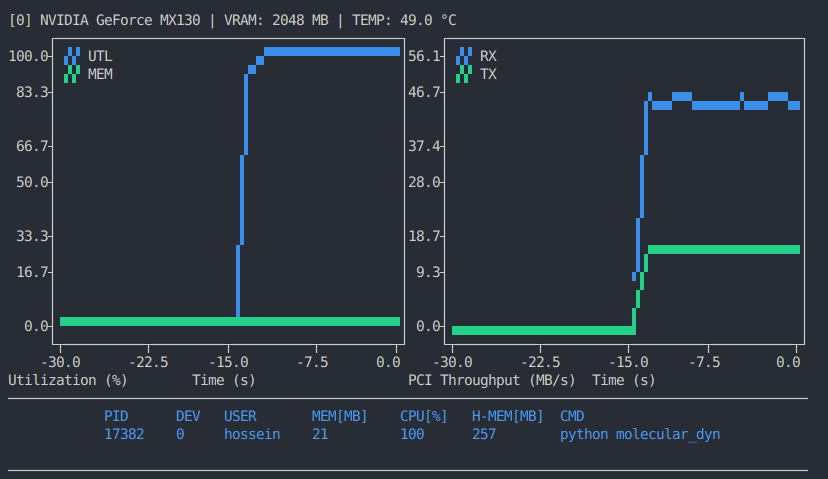

# GPU top

<!-- [](https://pypi.org/project/gtop) -->
<!-- [](https://opensource.org/licenses/MIT) -->

A basic command line tool to monitor GPU usage.

<!--
## Motivation
Current GPU monitoring tools often fall short in two ways:

* Inflexible metric selection: users should be able to customize which metrics they need to collect, rather than being limited to predefined sets.
* No PCI throughput metrics: RX and TX metrics are important, as data transfer between CPU and GPU is frequently the computational bottleneck.
-->

<!--
## Features
The following features are planned for this tool:

[x] Basic metrics like GPU utilization, memory usage, PCI throughput
[x] Targeting Nvidia GPUs, with potential extension to AMD GPUs
[x] A table of GPU processes
[x] User-level customization 
* Lightweight and minimal
* Multiple GPU support 
-->

## Installation

To install `gpu-top`, run the following command:

```bash
pip install --user git+https://github.com/hghcomphys/gpu-top.git
```

This will install required dependencies and add `gtop` command to your user-specific PATH (`~/.local/bin`). 
You can then run `gtop` directly.

To uninstall, use the following command:

```bash
pip uninstall gpu-top
```

## Example

```bash
gtop
```



Default device index is 0, but this can be changed via `--device-index` or simply `-d` flag.


### Text-mode

Text mode (no plot) can be enabled via `--text-mode` or `-t` flag:

```bash
gtop -t
```

<!-- 
```
CollectedMetrics(Time=0.10 [s], Process=0.00 [%], Memory=2.31 [%], PCI-RX=0.00 [MB/s], PCI-TX=0.00 [MB/s])
CollectedMetrics(Time=1.13 [s], Process=0.00 [%], Memory=2.31 [%], PCI-RX=0.00 [MB/s], PCI-TX=0.00 [MB/s])
...
CollectedMetrics(Time=10.14 [s], Process=100.00 [%], Memory=3.74 [%], PCI-RX=42.37 [MB/s], PCI-TX=0.01  [MB/s])
CollectedMetrics(Time=11.18 [s], Process=100.00 [%], Memory=3.74 [%], PCI-RX= 0.03 [MB/s], PCI-TX=11.02 [MB/s])
``` -->


### Configuration 
Using `--generate-config` or `-g` flag will automatically generate a default configuration file at:

```bash
gtop -g
Generating default configuration '~/.gputoprc'.
```

Once this file exists, you can edit it to customize how `gtop` behaves or displays system metrics.
For example, to switch from the default timeline plot to a bar plot, update `dashboard_plot_bar` to `true`.
After saving, `gtop` graphs will appear as bar plots instead of time-based line plots.

Note: If you remove `~/.gputoprc`, gtop will automatically fall back to the default configuration.


## License
This project is licensed under the MIT License - see the [LICENSE](LICENSE) file for details.
